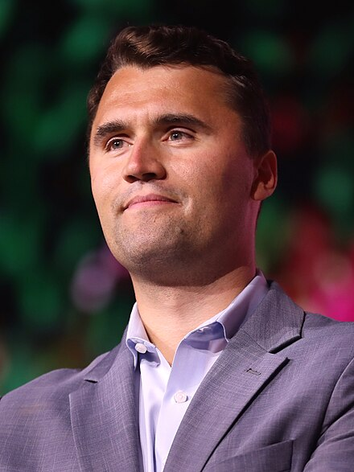

[RCJ](https://einzelgaengerinmotte.wordpress.com/wp-content/uploads/2018/02/revision-controlled_journalism_v2.pdf) report on the assassination of Charlie Kirk. [Contribute](contribute.md) information and corrections.

## Background

Charlie Kirk was a right-wing political activist. He set up booths on college campuses and invited students to debate on any topic.

## Incident

On September 10, 2025, as the first stop in [The American Comeback Tour](https://www.americancomebacktour.com/), Charlie was at [Utah Valley University](https://www.uvu.edu/) (UVU) in Orem, Utah.

A questioner approached the microphone and raised the topic of transgender mass shooters. They had [a short exchange](https://archive.is/W6wv2):

> Questioner: Do you know how many transgender Americans have been mass shooters over the last 10 years?
>
> Kirk: Too many.
>
> Questioner: Do you know how many mass shooters there have been in America over the last 10 years?
>
> Kirk: Counting or not counting gang violence?

At this point a shot was fired that hit Charlie Kirk in the neck. He was rushed to the hospital. Shortly after 2 PM, he was pronounced dead.

## Investigation

Authorities began an investigation the same day. A rifle was found in a wooded area nearby. Bullet casings found with the rifle were [engraved with messages](engravings.md).

After a 33 hour manhunt, Tyler Robinson was arrested and charged with the shooting.

Some online material seemed to indicate [foreknowledge](foreknowledge.md) of the attack.

## Public Response

Disputes arose over [the views of Charlie Kirk](views.md). Some people [celebrated](celebration.md) his murder. Some people [were fired or experienced other backlash](shunning.md) for their response to the event.
