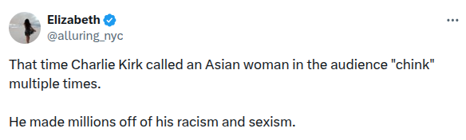

# Asian slur

**Claim**: Charlie called an Asian [chink](https://en.wiktionary.org/wiki/Chink).

## Assertion

> [Charlie Kirk] referred to Asian individuals by the C-word: a word too violent for me to even utter.

  
Video

  <iframe frameborder="0" width="560" height="315" src="https://www.youtube.com/embed/apyCJlSm4Q4?start=141&end=145" allow="fullscreen"></iframe>

> That time Charlie Kirk called an Asian woman in the audience "chink" multiple times.
>
> He made millions off of his racism and sexism.
>
> -- [@alluring_nyc](https://x.com/alluring_nyc) ([September 10, 2025](https://archive.is/04uQX))

  
Tweet

  

## Evidence

A clip of an argument with an audience member.

  
Video

  <iframe frameborder="0" width="560" height="315" src="https://www.youtube.com/embed/apyCJlSm4Q4?start=101&end=105" allow="fullscreen"></iframe>

## Correction

This was an exchange with left-wing political commentator [Cenk Uygur](https://en.wikipedia.org/wiki/Cenk_Uygur). The word interpreted as a slur was the name Cenk (pronounced _chenk_).

The incident occurred at Politicon 2018 during [a debate](https://www.youtube.com/watch?v=2RIKm-cOdh0) between Charlie Kirk and Hasan Piker. Cenk was in the audience. Cenk's news program The Young Turks posted the clip with the description: "Charlie Kirk gets triggered by Cenk Uygur at Politicon 2018."

> I live like a capitalist every single day, Cenk! I live as a capitalist, OK! I live what I believe!
>
> -- Charlie Kirk (2018)

  
Video

  <iframe frameborder="0" width="560" height="315" src="https://www.youtube.com/embed/_8Dho35c0Vs" allow="fullscreen"></iframe>

